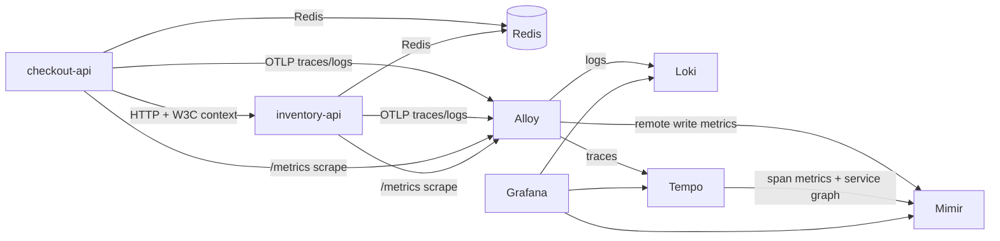

# lgtm-docker-starter

Reusable local LGTM starter stack with Grafana, Loki, Tempo, Mimir, Alloy, and a correlated FastAPI demo app. It is built for local development, debugging, demos, and as a base repository you can adapt to your own services.

## Why This Repo Exists

This project gives you a working local environment where logs, metrics, and traces are all correlated out of the box:

- metrics in Mimir include exemplars that link to Tempo traces
- logs in Loki carry `trace_id` and `span_id` so Grafana can jump from logs to traces
- traces in Tempo link back to matching logs and metrics
- Tempo generates service graph and span metrics and writes them into Mimir

The demo app is intentionally small, but the observability wiring is complete enough to reuse as a starting point.

## Stack

- Grafana `12.4.2`
- Loki `3.7.1`
- Tempo `2.10.3`
- Mimir `3.0.5`
- Alloy `1.15.0`
- Redis `7.4`
- FastAPI demo services: `checkout-api`, `inventory-api`
- Optional `loadgen` profile for steady traffic

## Compatibility

- Validated on Linux `x86_64` with Docker Engine and `docker compose`
- Host-side helper scripts expect `bash`, `curl`, and `python3`
- Container images are upstream official images or standard Python base images
- Local persistence is bind-mounted under `data/`

This repository is local-first. It is not production-hardened and does not include TLS, auth between internal services, or object storage.

## Architecture



## Quick Start

```bash
make up
make smoke
```

Open Grafana at `http://localhost:3000` and sign in with `admin` / `admin`.

To keep synthetic traffic running:

```bash
make load
```

To stop the stack:

```bash
make down
```

To remove containers, volumes, and local runtime state:

```bash
make clean
make reset-data
```

## Repository Layout

```text
.
├── app/                  Demo services and shared telemetry wiring
├── config/
│   ├── alloy/            Collector and routing config
│   ├── grafana/          Datasources, dashboards, provisioning
│   ├── loki/             Loki single-binary local config
│   ├── mimir/            Mimir monolithic local config
│   └── tempo/            Tempo local config and metrics-generator
├── scripts/              Smoke test and optional load generation
├── docker-compose.yml    Full local stack definition
└── Makefile              Common local workflows
```

## Demo API

`POST /api/checkout`

Example:

```bash
curl -X POST http://localhost:8000/api/checkout \
  -H 'Content-Type: application/json' \
  -d '{"user_id":"demo-user","sku":"sku-1","quantity":1,"mode":"ok"}'
```

Supported request modes:

- `ok`
- `slow`
- `fail_inventory`

Example response:

```json
{
  "order_id": "210d8bf4d59047318199bff3d53beea0",
  "status": "ok",
  "trace_id": "d3d577558cdf38e8faa819b06a54b52d",
  "inventory_status": "reserved",
  "cache_hit": true
}
```

## What To Verify In Grafana

- Loki logs show `trace_id` and link to Tempo traces
- Tempo traces link back to matching logs in Loki
- Mimir latency metrics show exemplars that open traces
- Tempo service graph shows `checkout-api -> inventory-api`
- Error and slow modes appear consistently across traces, logs, and RED metrics

## Useful Commands

```bash
make help
make check
make up
make smoke
make logs
make load
make down
```

## CI

GitHub Actions validates the repository by:

- checking that `docker compose` renders successfully
- compiling Python sources
- building and starting the stack
- running the smoke test

The workflow lives in `.github/workflows/ci.yml`.

## Troubleshooting

If Grafana shows empty dashboards or service graphs:

- run `make smoke` once to generate at least one correlated request
- run `make load` to keep traffic flowing
- check `docker compose logs tempo alloy mimir loki grafana`

If Trace Drilldown fails with a Tempo generator error:

- make sure Tempo has the `local-blocks`, `span-metrics`, and `service-graphs` processors enabled in [config/tempo/tempo.yaml](config/tempo/tempo.yaml)

## Public Release Notes

Before publishing publicly, choose a license that matches how you want others to use the repository. This repo intentionally does not pick one for you.
